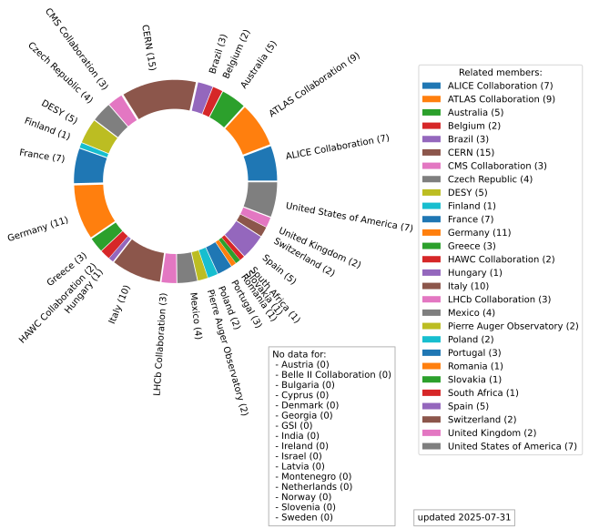
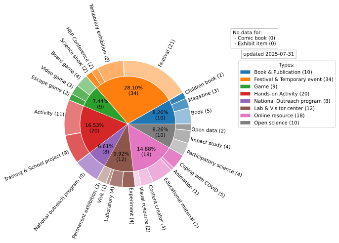

# IPPOG Ressource database formatting tool

<p align="center">
  <a href="https://ippog-resources-portal.web.cern.ch/">
    
  </a>
</p>

Made as part of the Administractive Student Contract of Hector PILLOT  (01/03/25 - 31/07/25)

## The project
The “Resource portal” was created in 2025, at the request of the HEP community during the ICHEP
2024 conference2. It aims both to give an idea of outreach projects for the scientific community and
to give a fair impression of the engagement and effort of the HEP outreach community.

The strategy for this resource portal is to serve as an online project database in which each outreach project is described in a post. We decided to start by uploading the projects presented by their owners and developers during IPPOG meetings’ "success stories" sections. The idea here is to direct to a presentation by the authors themselves, possibly supplemented by a few resources. 

A repport is available in 

## Database formatting

The goal of this workflow is to facilitate the work of the IPPOG core team in uploading projects to the Wordpress [IPPOG Resource Portal](https://ippog-resources-portal.web.cern.ch/).

The aim is to let the community submit their projects through a simple and explicit [Google Form](https://forms.gle/tp2t45JroU8sFffH9) linked to a Google Sheet document. It allows to guide the user through the form, and to automatically fill the database on Google Sheet.

The [Google Sheet](https://docs.google.com/spreadsheets/d/1x_SdxdlHwG8chH77WqrTAAgijY2XBY3nPIi2p3TKqzs/edit?usp=sharing) is formated so to be easily read by a python code.

The user can either export the database as a CSV file (see `exemple_file.csv`) and run the code via `run_local.py` or enable the Google API to directly work with the online database and run the code via `run_online.py`. The code produces, for each line of the database, one markdown file in a directory named `output_markdown/`. These files are already formatted to be copy/pasted into the WordPress website.

The flowchart detailing the upload process is as follows:


## Dependencies
Libraries needed to run the code are: 

```
python3 -m pip install python-csv DateTime pathlib2
```

Optional parts of the code makes use of Google Sheets API and needs:
```
python3 -m pip install gspread google-auth google-auth-oauthlib google-auth-httplib2
```

## Running

Simply run 
```
python3 run_online.py
```

Or alternatively for the local version

```
python3 run_local.py
```
And input the name of the database CSV file


## Upload process
The upload process is detailed in the video bellow: 

<p align="center">
  <a href="https://www.youtube.com/watch?v=OQ6QYBG_MYU">
    
  </a>
</p>

## Taxonomy
The website aims to function as an online repository for outreach projects, serving as a resource hub. Therefore, it’s essential to arrange these projects, and considerable work has gone into defining a taxonomy for classifying them. The final taxonomy finally stabilized with 25 categories grouped into 4 meta-categories:

**Topic** refers to the main subject that the project focuses on.
*It can be, for example: Physics, Art, Sociology...*

**Type** refers to the format that the project takes.
*It can be, for example: Book, Movie, Show...*

**Audience** refers to the intended public, the specific group to which the project is adapted.
*It can be, for example: Adults, Children, Scientists...*

**Language** is a bit different from the other categories. It corresponds to the language in which
projects were developed and aims to group together same-language projects in an effort to form
discussion groups to help build language-specific pages and/or to collect material.

Topics and Types Categories and tags work in the following way:

|  |  |
| - | - |

Made by FraMindmap

## Data
At the moment, 121 projects have been posted on the website. Statistics regarding the affiliated IPPOG (associated) members, topics, and types are available:

Simply run 
```
python3 data_analysis_online.py
```

Or alternatively for the local version

```
python3 data_analysis_local.py
```
And input the name of the database CSV file

The following plots are saved in media/data/




## Contact
If you see any problems, don't hesitate to contact me at hector.pillot [at] proton.me